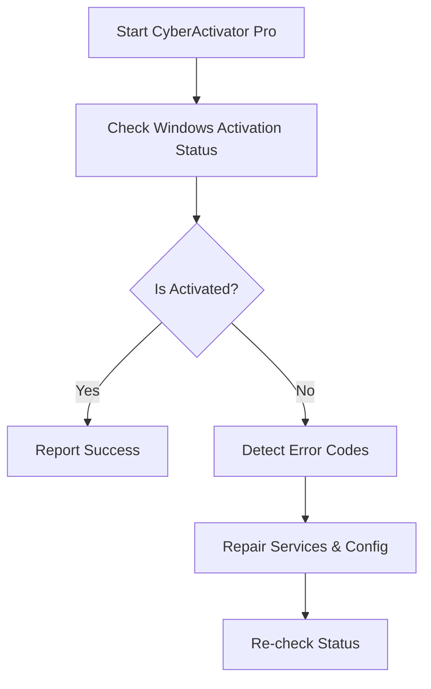

# 🚀 CyberActivator Pro

CyberActivator Pro is a **Windows activation diagnostic and repair utility** designed to **detect common activation-related issues** and **guide fixes** using **official Windows tools and APIs**. The project focuses on **troubleshooting, status reporting, and configuration repair** — **not license bypassing**.

> ⚠️ **Disclaimer**: This project does **not** crack, bypass, or illegally activate Windows. It only helps diagnose problems and apply **legitimate fixes** (e.g., services, configuration, KMS client status, system integrity checks).

---

## ✨ Features

```text
✔ Detect Windows activation status
✔ Identify common activation errors (e.g. service stopped, corrupted files)
✔ Repair Windows licensing services
✔ Run official Windows activation troubleshooting commands
✔ Generate detailed diagnostic logs
✔ CLI-based automation support
```

---

## 🧠 How It Works (High Level)



---

## 🛠️ Supported Checks

```bash
- slmgr /xpr
- slmgr /dli
- slmgr /dlv
- Software Protection Service (sppsvc)
- Windows Update dependency
- System file integrity (sfc)
- DISM health status
```

---

## 📦 Installation

```bash
git clone https://github.com/your-username/CyberActivator-Pro.git
cd CyberActivator-Pro
```

> Requires **Administrator privileges** on Windows.

---

## ▶️ Usage

### CLI Mode

```powershell
CyberActivatorPro.exe --scan
CyberActivatorPro.exe --repair
CyberActivatorPro.exe --status
```

### Example Output

```text
[INFO] Checking activation status...
[WARN] Windows not activated
[INFO] Error Code Detected: 0xC004F074
[INFO] Restarting Software Protection Service...
[SUCCESS] Service restarted successfully
[INFO] Re-checking activation status...
```

---

## 📁 Project Structure

```text
CyberActivator-Pro/
│
├── src/
│   ├── checker/
│   ├── repair/
│   ├── logger/
│   └── cli/
│
├── scripts/
│   ├── activation.ps1
│   └── diagnostics.ps1
│
├── docs/
│   └── error-codes.md
│
├── README.md
└── LICENSE
```

---

## 🧪 Tested On

```text
✔ Windows 10 (21H2+)
✔ Windows 11
✔ Windows Server (Evaluation & Licensed Editions)
```

---

## 🔐 Security & Ethics

```text
• No license keys stored or generated
• No activation bypass techniques used
• Uses only official Microsoft utilities
• Designed for IT admins & support engineers
```

---

## 📜 License

```text
MIT License

Copyright (c) 2025
```

---

## 🤝 Contributing

```bash
# Fork the repository
# Create your feature branch
# Commit your changes
# Open a Pull Request
```

---

## 📧 Contact

```text
Author: CyberActivator Team
GitHub: https://github.com/your-username
```

---

⭐ If you find this project useful, consider giving it a star on GitHub!
